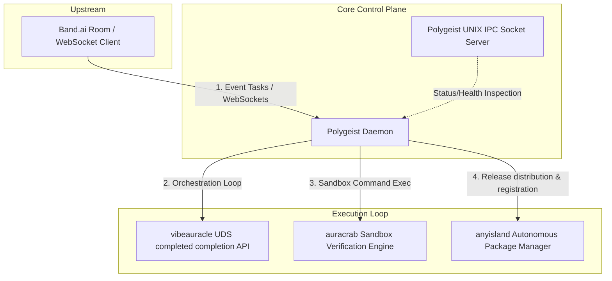

# 🌌 Polygeist: Autonomous Multi-Agent Orchestration Daemon

Polygeist is the sovereign orchestrator for local-first, agentic control loops. It bridges upstream developer communication channels (via **Band.ai**) directly to a decentralized suite of task completion engines operating entirely on the host system.



---

## Architecture & Core Philosophy

Polygeist coordinates mutations, verification, and distribution phases across three core modules via UNIX Domain Sockets (UDS), keeping the control plane robust, isolated, and responsive:

1. **Phase 1: Mutation (via `vibeauracle`)**: Runs completion/synthesis workflows to patch, modify, or extend the codebase under constraints specified in the room payload.
2. **Phase 2: Verification (via `auracrab`)**: Isolates modifications within a sandbox executor, running test suites, linters, and verification checks.
3. **Phase 3: Distribution (via `anyisland`)**: Builds, signs, and registers updated binaries securely to the target platform directory layout.

---

## Deployment & Installation

### Production Quickstart
Deploy the entire orchestration ecosystem (including `polygeist`, `anyisland`, `vibeaura`, and `auracrab`) with a single command:

```bash
curl -sSL https://raw.githubusercontent.com/nathfavour/polygeist/master/install.sh | bash
```
This installer places all binaries inside `~/.local/bin` and writes local UDS path configs to `~/.config/polygeist/env`.

### Building From Source
Clone the repository recursively to pull in all submodule components:

```bash
git clone --recursive https://github.com/nathfavour/polygeist
cd polygeist

# Setup submodules and workspace
./install.sh
./scripts/start-daemons.sh
```

---

## Daemon Interface & Flags

```bash
# Set up environment variables
source ~/.config/polygeist/env

# Start background daemons
anyisland daemon start
vibeaura daemon start

# Run Polygeist connecting to Band.ai
export BAND_API_KEY="your-agent-key"
export BAND_AGENT_ID="your-agent-id"
export BAND_CHAT_ID="your-chat-room-id"
polygeist --chat $BAND_CHAT_ID

# Run a single task locally (Offline/Cli mode)
polygeist --once "fix auth middleware" --workdir /path/to/target/project
```

### CLI Command Flags
* `--chat`: Specific Band.ai chat room ID (falls back to `BAND_CHAT_ID`).
* `--workdir`: Target workspace directory for mutations (defaults to current directory).
* `--bin`: Output binary override path for the distribution phase.
* `--once`: Runs a single prompt query string locally and exits (ideal for CI/CD integration).
* `--version`: Print build version info.

---

## UNIX IPC Status & Diagnostics

Polygeist opens a diagnostic socket at `~/.anyisland/polygeist.sock` (or path dictated by `POLYGEIST_IPC_SOCK`). External applications can query daemon health and phase state using JSON payload interfaces:

### Health Query Payload
```json
{
  "op": "HEALTH"
}
```

### Response Scheme
```json
{
  "status": "ok",
  "phase": "idle",
  "sockets": {
    "polygeist": "/home/user/.anyisland/polygeist.sock",
    "anyisland": "/home/user/.anyisland/anyisland.sock",
    "vibeauracle": "/home/user/.polygeist/run/vibeaura.sock"
  },
  "reachable": {
    "polygeist": true,
    "anyisland": true,
    "vibeauracle": true
  }
}
```

### Operational Phases
* **`idle`**: Daemon waiting for new events.
* **`mutating`**: `vibeauracle` is patching source code.
* **`verifying`**: `auracrab` is executing sandboxed test verifications.
* **`distributing`**: `anyisland` is releasing the final compiled executable.
